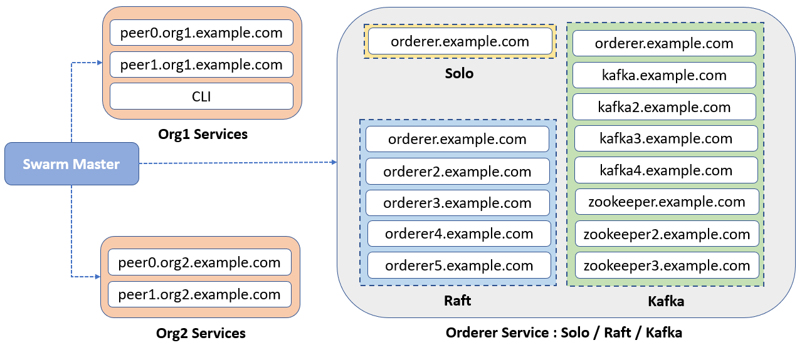

## Fabric Network Extensibility 
This tool helps to extend Hyperledger Fabric Network by using Docker Swarm. By default, tool provides support to ordering service based on Solo, Kafka and Raft mode.

**Tool Includes**
* Support to multi VM Fabric Network setup.
* Ordering service based on Solo, Kafka and Raft mode.
* Sample docker compose files for Orderer, Zookeeper, Kafka, Peer and CLI service.
* Service to add new Peer to Org.
* Service to add new Org to network.
* Service to remove Org from network.

### Installation Guide
Kindly install all the [Prerequisites](https://hyperledger-fabric.readthedocs.io/en/release-1.4/prereqs.html) mentioned on the official documentation. Make sure we have all the Docker Images downloaded locally.
We will be using JQ for Filtering JSON data.
```bash
       apt-get install jq
```
For exploration, we will take 4 VM with below specification.

|Organisation | VM Specification|
|-------------|-----------------|
|Swarm Master | 8GB, 2 vCPU     |
|Org1         | 8GB, 2 vCPU     |
|Org1         | 8GB, 2 vCPU     |
|Orderer      | 16GB, 4 vCPU    |




**Setup to Start**

* [Deploy Fabric Network](docs/network-setup.md)
* [Add New Peer](docs/add-new-peer.md)
* [Add New Organization](docs/add-new-org.md)
* [Remove Organization](docs/remove-org.md)


That’s it!


